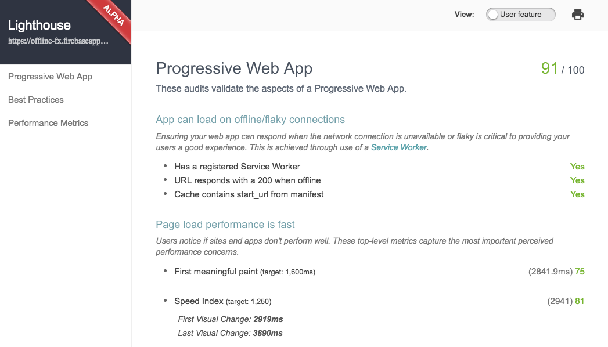

# PWA Codelab (Offline FX)

Offline FX is a [Progressive Web Application](https://developers.google.com/web/progressive-web-apps/) that allows users to keep track of currency exchange rates.

## Codelab Quickstart

- Clone or download this repository
- Install dependencies (Node.js and NPM)
- Run `npm install` to install development dependencies
- Run `gulp` to build site and listen for changes to source files
- Visit `localhost:4100`

## About the Application

- Plain JavaScript (ES6 compiled using Babel)
- Scored **91/100** in [Lighthouse](https://github.com/GoogleChrome/lighthouse)

## Credits

- Created by Ire Aderinokun
- [Common-Currency.json](https://gist.github.com/Fluidbyte/2973986)